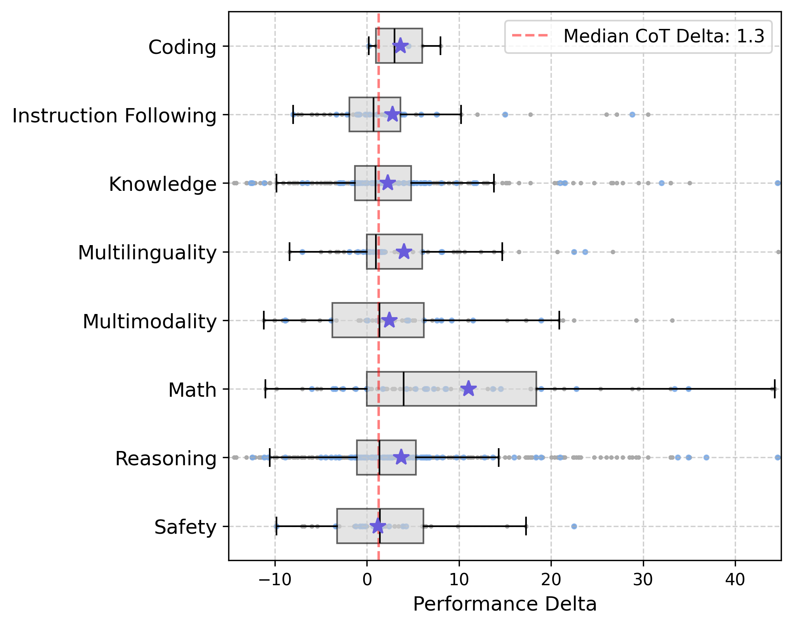
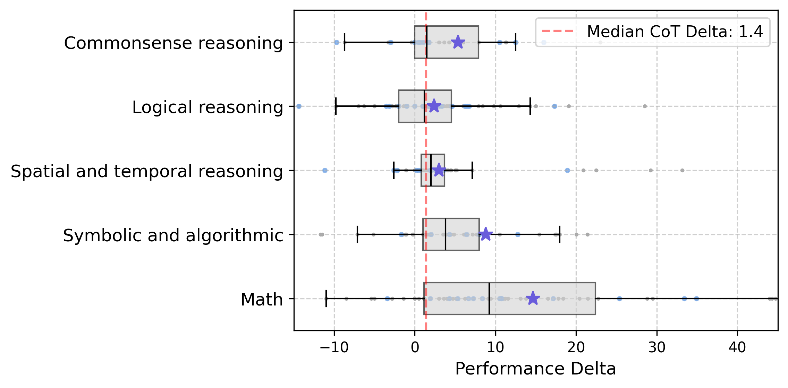
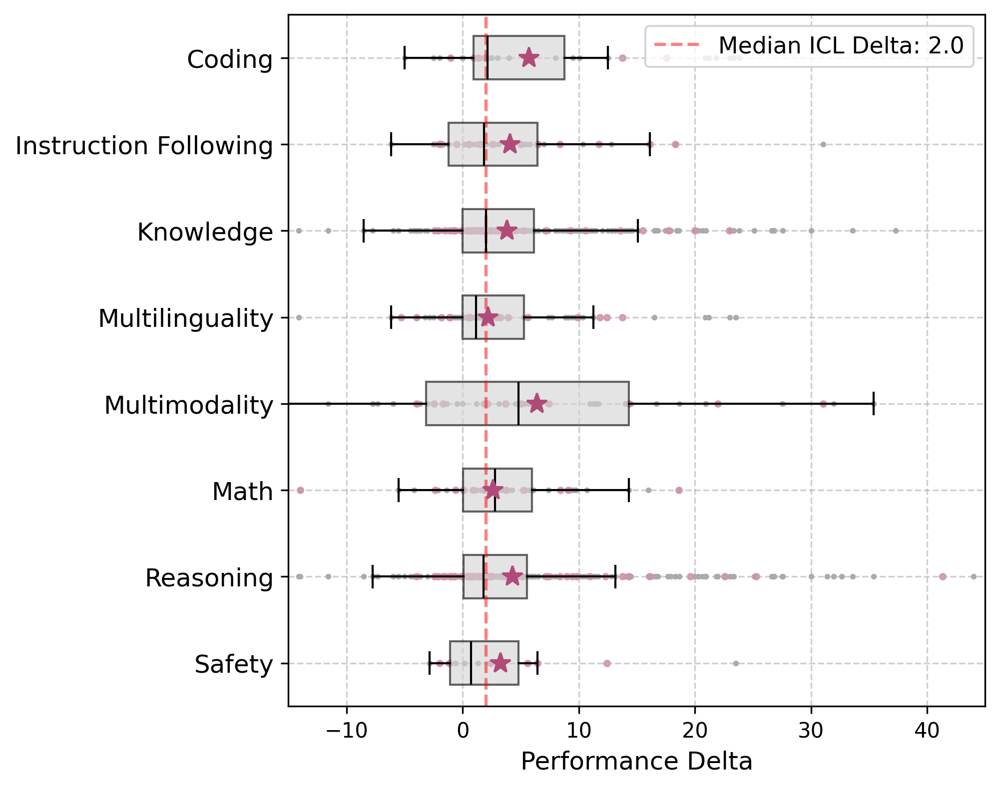

# Literature Analysis of Prompting Behavior in Frontier LLMs

## Introduction

This section provides the source code for conducting literature analysis based on our dataset: [LLMEvalDB](https://huggingface.co/datasets/jungsoopark/LLMs-Performance-Data).

## Analyses

- CoT Benefit Replication Study
    - Our Category (based on Tulu3 Category)
    - Sprague et al. 2024 Category
- ICL Benefit on Our Category
- Joint Behavior of CoT and ICL
## CoT Benefit Replication Study

### CoT Benefit on Our Category

```bash
python cot_replicate_analysis.py
```

### Results

The following figure shows the results of our CoT benefit replication study on our category:



### CoT Benefit on Sprague et al. Category

We analyze results based on categories from [Sprague et al. 2024 ICLR](https://arxiv.org/abs/2409.12183), with classifications stored in `classification_results/prompting_cot_study_replicate_sprague.txt`.

```bash
python cot_replicate_analysis.py --classification_results_sprague ./classification_results/prompting_cot_study_replicate_sprague.txt
```

### Results

The following figure presents our CoT benefit replication study results using the Sprague category framework:



## ICL Benefit Analysis

### ICL Benefit on Our Category

```bash
python icl_analysis.py 
```

### Results

The following figure illustrates our ICL benefit analysis results across the categories:



## Joint Behavior of CoT and ICL

```bash
python cot_icl_joint_behavior_analysis.py
```

### Results

The table below summarizes key metrics for the joint behavior of Chain-of-Thought and In-Context Learning approaches:

| Metric | CoT - Standard Prompting<br>(few_shot) | CoT - Standard Prompting<br>(zero_shot) | CoT + Few-shot - CoT + Zero-shot | CoT + More-shot - CoT + Less-shot |
|--------|---------------------------------------|----------------------------------------|---------------------------------------------|----------------------------------------------|
| Median | 0.95                                  | 1.37                                   | 3.00                                        | 3.10                                         |
| Mean   | 1.85                                  | 3.80                                   | 3.65                                        | 3.74                                         |
| Q1     | -1.23                                 | -0.40                                  | 0.35                                        | 0.42                                         |
| Q3     | 3.70                                  | 4.78                                   | 9.16                                        | 8.98                                         |
| Std    | 9.62                                  | 12.84                                  | 9.18                                        | 9.30                                         |
